# PlantUML User Flow Diagrams - Complete Application Flow

This document contains comprehensive PlantUML prompts to generate flowcharts depicting the entire user flow of the VOMS PWA application, including all actions, logic, and capabilities at every step.

## Application Overview

**VOMS PWA** is a Progressive Web Application for Vehicle Operations Management System with the following modules:
- **Gate Pass Management** - Visitor and vehicle pass creation, validation, and approval
- **Inspections** - Vehicle inspection capture, templates, and reporting
- **Expenses** - Employee expense submission, approval, and ledger management
- **Stockyard** - Component (battery, tyre, spare parts) tracking and movement management
- **Unified Approvals** - Centralized approval hub for all modules
- **User Management** - Role-based access control and user administration
- **Alerts & Notifications** - System alerts and user notifications

**User Roles:**
- `super_admin` - Full system access
- `admin` - Administrative access
- `supervisor` - Can approve passes and expenses
- `inspector` - Can perform vehicle inspections
- `guard` - Can validate gate passes
- `clerk` - Basic operations

---

## 1. Authentication & Authorization Flow

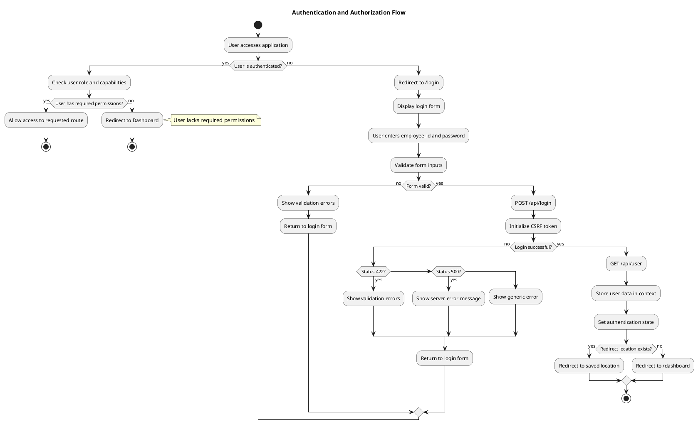

---

## 2. Main Dashboard Flow

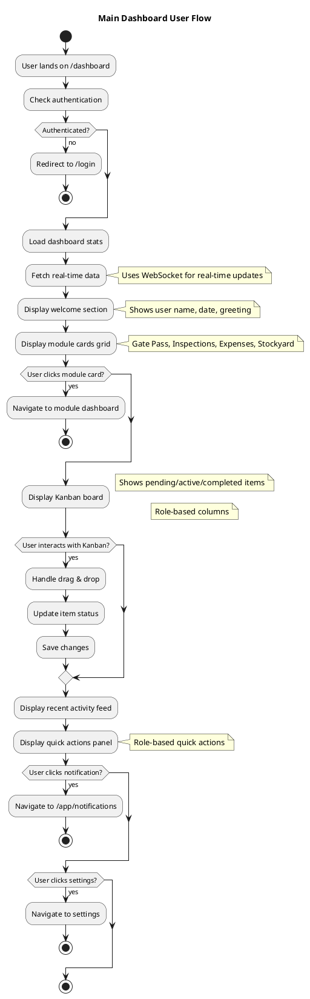

---

## 3. Gate Pass Module - Complete Flow

### 3.1 Gate Pass Dashboard Flow

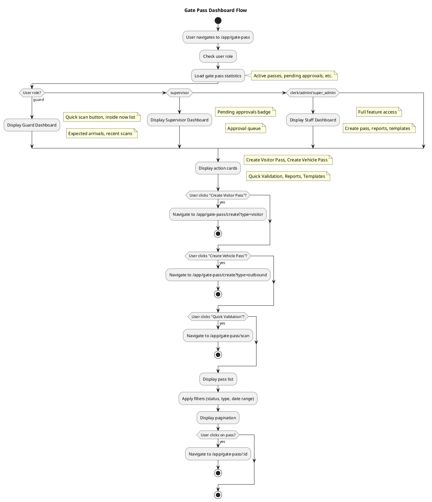

### 3.2 Gate Pass Creation Flow

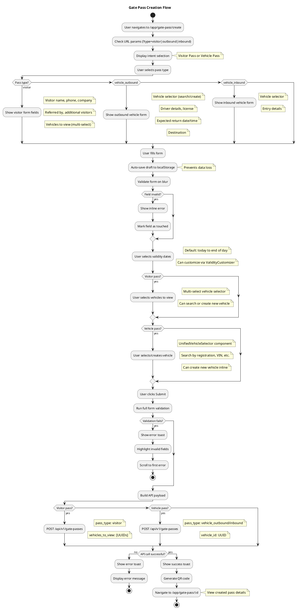

### 3.3 Gate Pass Validation Flow (Guard)

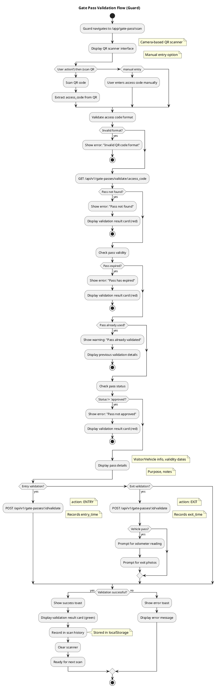

### 3.4 Gate Pass Approval Flow

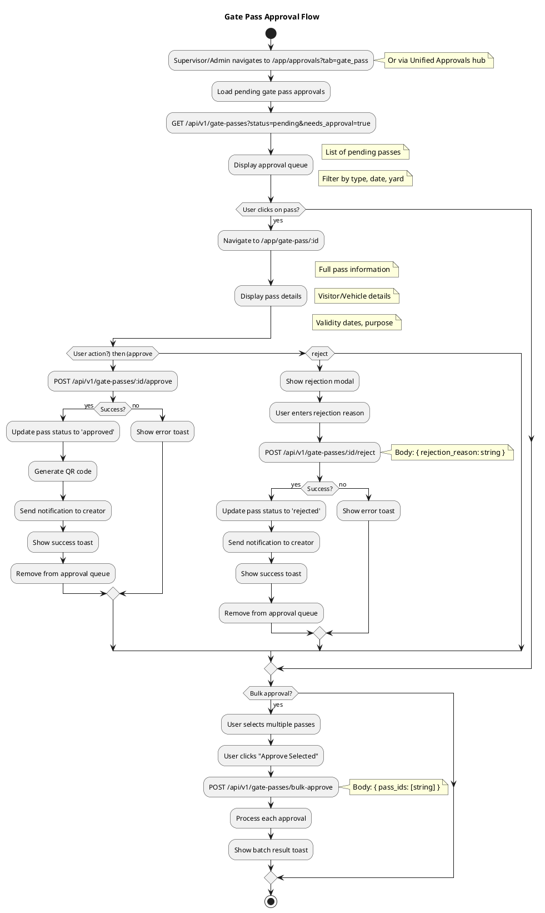

---

## 4. Inspections Module - Complete Flow

### 4.1 Inspection Template Selection Flow

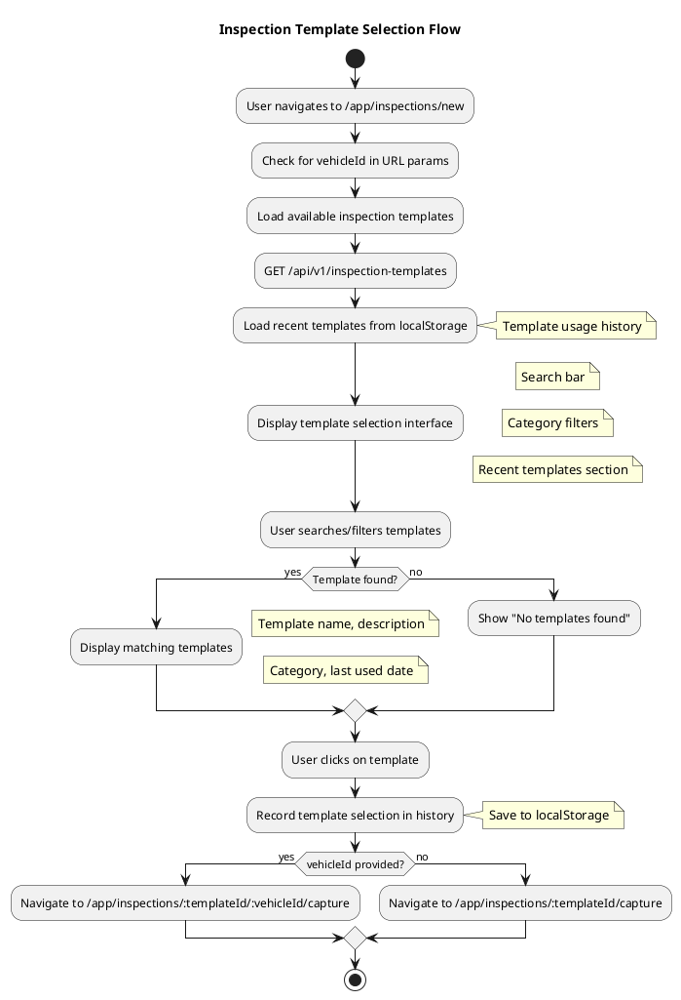

### 4.2 Inspection Capture Flow

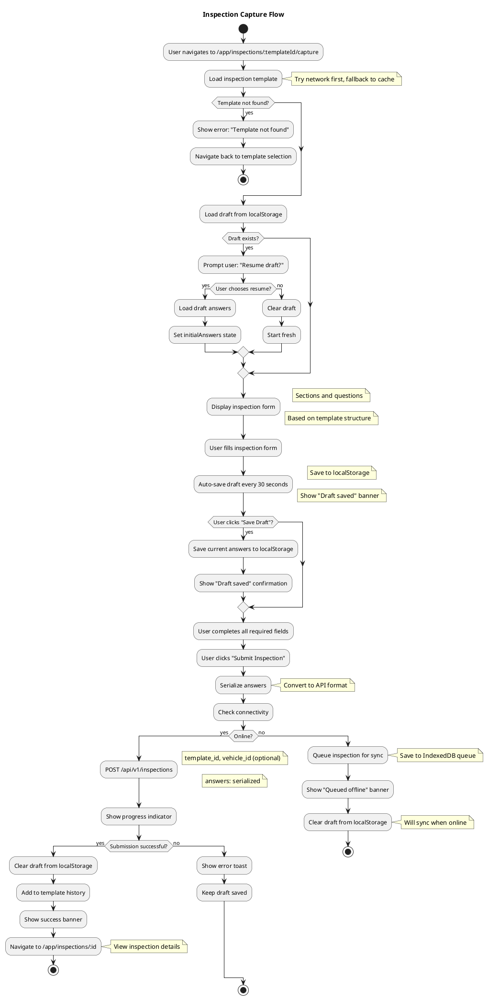

### 4.3 Inspection Sync Flow

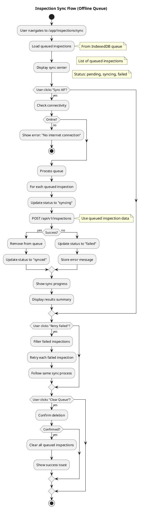

### 4.4 Inspection Details & Report Flow

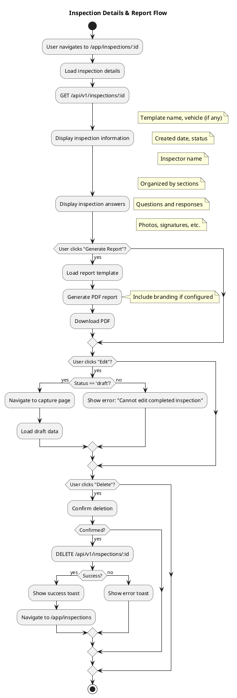

---

## 5. Expenses Module - Complete Flow

### 5.1 Expense Creation Flow

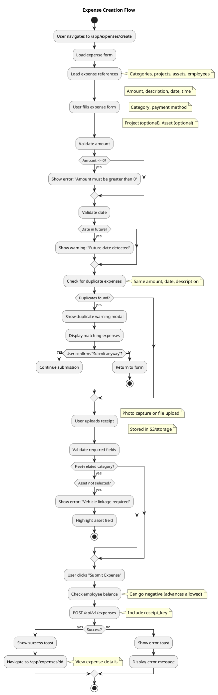

### 5.2 Expense Approval Flow

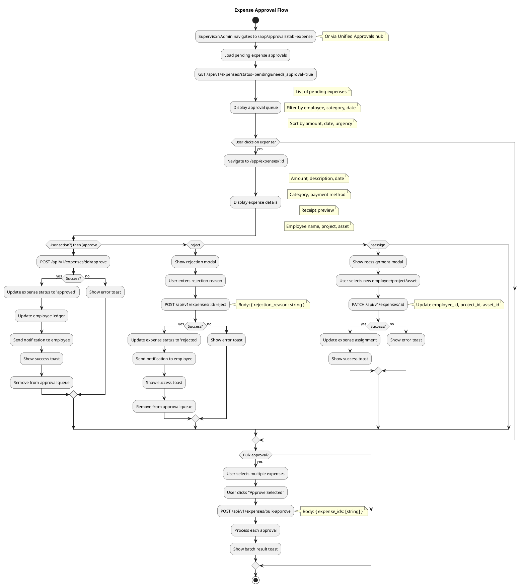

### 5.3 Employee Ledger Flow

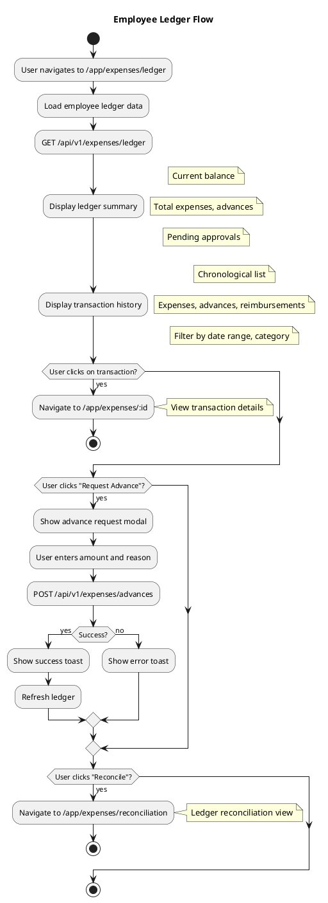

---

## 6. Stockyard Module - Complete Flow

### 6.1 Component Movement Flow

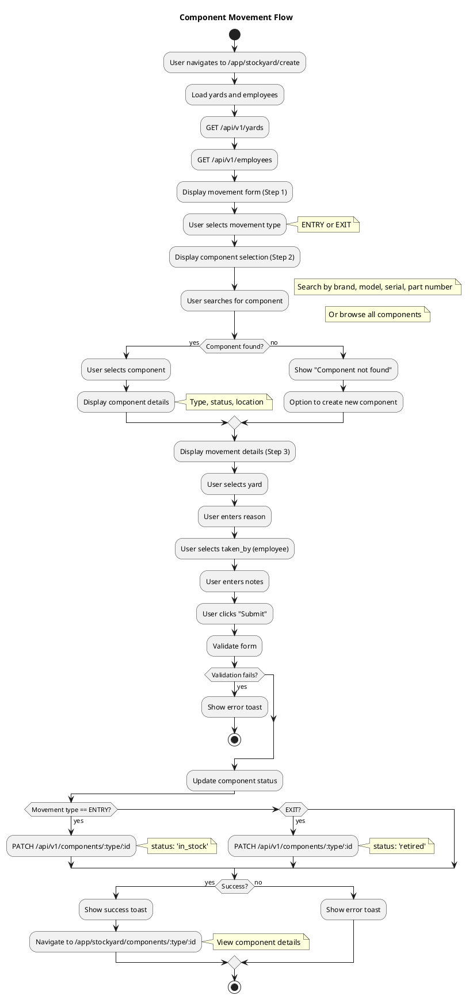

### 6.2 Component Transfer Flow

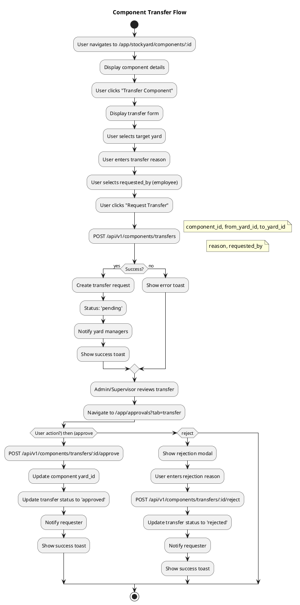

### 6.3 Stockyard Request Scan Flow

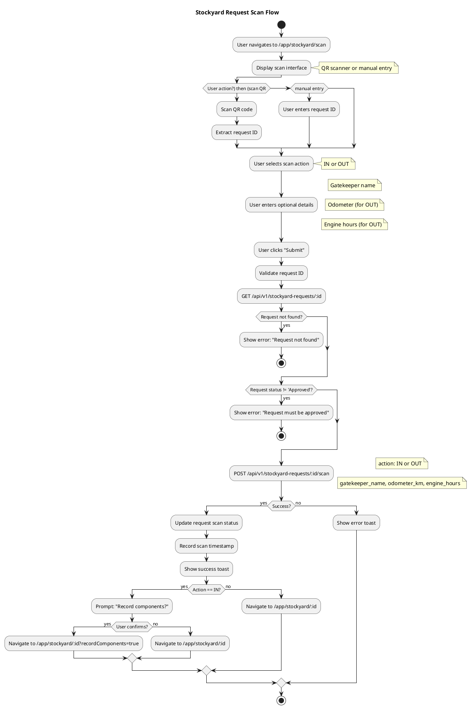

---

## 7. Unified Approvals Hub Flow

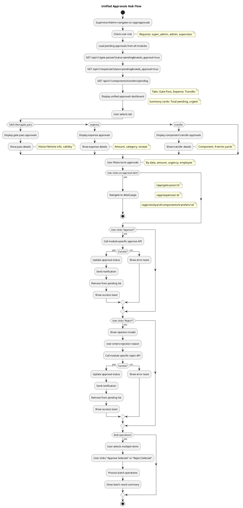

---

## 8. User Management Flow

```plantuml
@startuml User_Management_Flow
title User Management Flow

start

:Super Admin/Admin navigates to /app/admin/users;
:Check user role;
note right: Requires: super_admin, admin

:Load users list;
:GET /api/v1/users;

:Display users table;
note right: Name, email, role, status
note right: Last login, actions

:User filters/sorts;
note right: By role, status, yard

if (User clicks "Create User"?) then (yes)
  :Show create user modal;
  :User enters details;
  note right: Name, email, employee_id
  note right: Role, yard, password
  :POST /api/v1/users;
  if (Success?) then (yes)
    :Show success toast;
    :Refresh users list;
  else (no)
    :Show error toast;
  endif
endif

if (User clicks on user row?) then (yes)
  :Navigate to /app/admin/users/:id;
  :Display user details;
  note right: Profile, permissions, activity
  note right: Capability matrix
  
  if (User clicks "Edit"?) then (yes)
    :Show edit user modal;
    :User updates details;
    :PATCH /api/v1/users/:id;
    if (Success?) then (yes)
      :Show success toast;
      :Refresh user details;
    else (no)
      :Show error toast;
    endif
  endif
  
  if (User clicks "Reset Password"?) then (yes)
    :Show reset password modal;
    :User enters new password;
    :POST /api/v1/users/:id/reset-password;
    if (Success?) then (yes)
      :Show success toast;
    else (no)
      :Show error toast;
    endif
  endif
  
  if (User clicks "Deactivate"?) then (yes)
    :Confirm deactivation;
    if (Confirmed?) then (yes)
      :PATCH /api/v1/users/:id;
      note right: is_active: false
      :Show success toast;
      :Refresh user details;
    endif
  endif
endif

if (User clicks "Bulk Operations"?) then (yes)
  :Navigate to /app/admin/users/bulk-operations;
  :Display bulk operations interface;
  note right: Select users, choose action
  note right: Assign role, activate/deactivate
  note right: Export, import
endif

if (User clicks "Capability Matrix"?) then (yes)
  :Navigate to /app/admin/users/capability-matrix;
  :Display capability matrix;
  note right: Roles vs Modules vs Actions
  note right: Visual permission grid
endif

stop

@enduml
```

---

## 9. Notifications & Alerts Flow

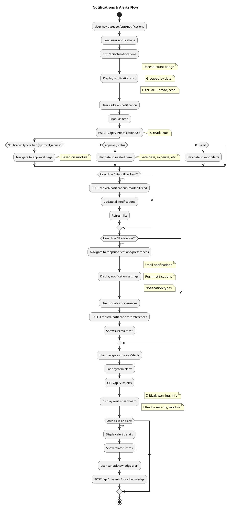

---

## 10. Settings & Configuration Flow

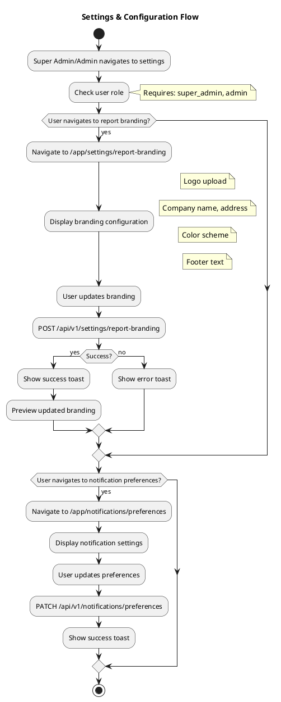

---

## 11. Offline & Sync Flow

```plantuml
@startuml Offline_Sync_Flow
title Offline & Sync Flow

start

:User uses application;
:Monitor connectivity;
note right: Online/offline detection

if (Connection lost?) then (yes)
  :Show offline indicator;
  :Enable offline mode;
  note right: Store actions in queue
  note right: Use cached data
  
  :User performs actions;
  if (Action type?) then (create inspection) then
    :Queue inspection for sync;
    :Store in IndexedDB;
  else if (create expense) then
    :Queue expense for sync;
    :Store in IndexedDB;
  else if (create gate pass) then
    :Show error: "Requires online connection";
    note right: Gate passes need immediate validation
  endif
endif

if (Connection restored?) then (yes)
  :Hide offline indicator;
  :Show "Syncing..." message;
  :Process sync queue;
  
  :For each queued item;
  :Retry API call;
  if (Success?) then (yes)
    :Remove from queue;
    :Update UI;
  else (no)
    :Mark as failed;
    :Store error;
  endif
  
  :Show sync summary;
  note right: X items synced, Y failed
endif

if (User navigates to sync center?) then (yes)
  :Navigate to /app/inspections/sync;
  :Display sync queue;
  :User can manually retry failed items;
  :User can clear queue;
endif

stop

@enduml
```

---

## 12. Role-Based Navigation Flow

```plantuml
@startuml Role_Based_Navigation_Flow
title Role-Based Navigation Flow

start

:User logs in;
:Load user role and capabilities;
:Determine navigation menu;

if (User role?) then (guard) then
  :Show guard navigation;
  note right: Gate Pass (validation only)
  note right: Inspections (read only)
  note right: Dashboard
else if (clerk) then
  :Show clerk navigation;
  note right: Gate Pass (create, read)
  note right: Expenses (create, read)
  note right: Inspections (read only)
  note right: Dashboard
else if (inspector) then
  :Show inspector navigation;
  note right: Inspections (create, read, update)
  note right: Expenses (create, read)
  note right: Gate Pass (read only)
  note right: Dashboard
else if (supervisor) then
  :Show supervisor navigation;
  note right: Approvals (all modules)
  note right: Gate Pass (approve, validate)
  note right: Expenses (approve)
  note right: Inspections (approve, review)
  note right: Reports (read)
  note right: Dashboard
else if (admin) then
  :Show admin navigation;
  note right: All modules (full access)
  note right: User Management (read, update)
  note right: Reports (read, export)
  note right: Settings
  note right: Dashboard
else if (super_admin) then
  :Show super admin navigation;
  note right: All modules (full access)
  note right: User Management (full access)
  note right: Reports (read, export)
  note right: Settings (full access)
  note right: Dashboard
endif

:Display navigation menu;
:User clicks menu item;
:Check route permissions;
if (User has permission?) then (yes)
  :Navigate to route;
else (no)
  :Show error: "Access denied";
  :Redirect to dashboard;
endif

stop

@enduml
```

---

## Usage Instructions

1. **Copy each PlantUML diagram code block** into a PlantUML editor or renderer
2. **Recommended tools:**
   - [PlantUML Online Server](http://www.plantuml.com/plantuml/uml/)
   - [VS Code PlantUML Extension](https://marketplace.visualstudio.com/items?itemName=jebbs.plantuml)
   - [IntelliJ IDEA PlantUML Plugin](https://plugins.jetbrains.com/plugin/7017-plantuml-integration)

3. **Generate diagrams** for each flow to visualize the complete application flow

4. **Customize as needed:**
   - Add more detail to specific steps
   - Combine related flows
   - Add error handling details
   - Include API endpoint details

---

## Summary of All Flows

1. **Authentication & Authorization** - Login, role checking, permission validation
2. **Main Dashboard** - Module navigation, Kanban board, quick actions
3. **Gate Pass Module** - Creation, validation (guard), approval, templates
4. **Inspections Module** - Template selection, capture, offline sync, reports
5. **Expenses Module** - Creation, approval, ledger management, reconciliation
6. **Stockyard Module** - Component movement, transfers, scanning, analytics
7. **Unified Approvals** - Centralized approval hub for all modules
8. **User Management** - User CRUD, capability matrix, bulk operations
9. **Notifications & Alerts** - Notification management, alert dashboard
10. **Settings** - Report branding, notification preferences
11. **Offline & Sync** - Offline queue management, sync operations
12. **Role-Based Navigation** - Dynamic menu based on user role

Each flowchart includes:
- ✅ Exact user actions at every step
- ✅ Logic and decision points
- ✅ API endpoints and data flow
- ✅ Error handling
- ✅ Role-based access control
- ✅ Navigation paths
- ✅ State management details


