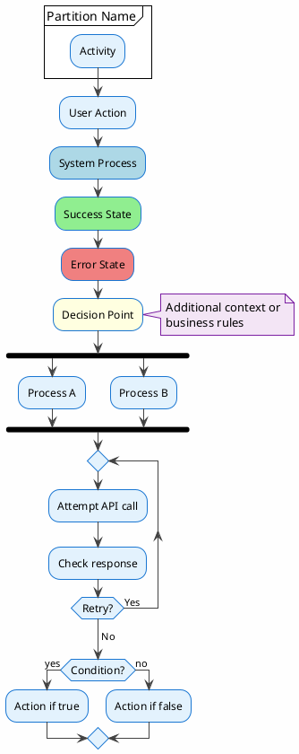

# Comprehensive PlantUML Generation Prompt for VOMS Application

Generate comprehensive PlantUML flowcharts for the VOMS (Vehicle Operations Management System) Progressive Web Application. Create separate detailed flowcharts for each major module and user flow.

## Application Overview

VOMS is a comprehensive PWA for vehicle inspection and operations management built with:
- **Frontend**: React 19, TypeScript, Vite
- **Backend**: Laravel 11 REST API
- **Authentication**: Laravel Sanctum (cookie-based)
- **State Management**: React Query + Context API
- **Offline Support**: IndexedDB, Service Worker, Offline Queue
- **Real-time**: WebSocket (Reverb) + Pusher for notifications
- **Live URL**: inspectmymachine.in
- **API**: api.inspectmymachine.in

## User Roles

1. **super_admin** - Full system access
2. **admin** - Administrative access, reports, user management
3. **supervisor** - Approval workflows, monitoring
4. **guard** - Gate pass validation and scanning
5. **clerk** - Data entry and basic operations
6. **inspector** - Vehicle inspections

## Required PlantUML Flowcharts

Generate the following flowcharts with complete logic, decision points, and error handling:

---

### 1. AUTHENTICATION & AUTHORIZATION FLOW

**Flowchart Name**: `01-authentication-flow.puml`

**Include**:
- Initial app load and service worker registration
- Check if user is authenticated (via `/api/user` endpoint)
- Login form submission with CSRF token
- Sanctum cookie-based authentication
- Role-based routing after login
- Session validation and token refresh
- Logout process with API call
- Redirect to login if unauthorized (401)
- Offline authentication handling (cached user data)
- "Remember me" functionality
- Password validation rules
- Error handling for network failures
- PWA install prompt logic

**Decision Points**:
- Is user authenticated?
- Is session valid?
- Does user have required role for route?
- Is device online?
- Is PWA installed?

---

### 2. DASHBOARD & NAVIGATION FLOW

**Flowchart Name**: `02-dashboard-navigation-flow.puml`

**Include**:
- Dashboard load with role-based widget display
- Real-time WebSocket connection establishment
- Fallback to polling if WebSocket fails
- Widget data fetching via React Query
- Statistics aggregation (daily, weekly, monthly)
- Navigation menu based on user role
- Quick action buttons (create pass, start inspection, etc.)
- Notification bell with unread count
- Theme toggle (light/dark mode)
- Alert badges for pending approvals
- Widget customization and reordering (drag-and-drop)
- Refresh data on pull-to-refresh
- Offline indicator display
- Background sync status

**Data Displayed**:
- Active gate passes count
- Pending approvals count
- Today's inspections count
- Pending expenses count
- Stockyard alerts count
- Recent activity timeline

---

### 3. VEHICLE INSPECTION MODULE - COMPLETE FLOW

**Flowchart Name**: `03-inspection-complete-flow.puml`

**Include**:

#### 3A. Template Selection & Cache
- Navigate to Inspections → New
- Fetch available templates from API
- Cache templates in IndexedDB for offline
- Display template cards with:
  - Template name
  - Total questions count
  - Last updated date
  - Version number
- Select template
- Check if draft exists for this vehicle+template
- Option to resume draft or start new

#### 3B. Vehicle Selection
- Search vehicle by registration number
- Fetch vehicle details from API
- Display vehicle info (make, model, year)
- Option to create new vehicle if not found
- Associate vehicle with inspection

#### 3C. Inspection Capture Process
- Load inspection template with sections
- Display progress bar (X of Y questions)
- Auto-save draft every 30 seconds to IndexedDB
- Section-by-section navigation

**Question Types & Logic**:
1. **Text Input**: Simple text field
2. **Number Input**: Numeric validation
3. **Single Choice**: Radio buttons
4. **Multiple Choice**: Checkboxes
5. **Date/Time**: Date picker
6. **Signature**: Canvas-based signature capture
7. **Photo Capture**:
   - Access camera via getUserMedia
   - Capture photo
   - Compress image
   - Store in IndexedDB
   - Upload when online (background sync)
   - Show thumbnail
   - Allow multiple photos
8. **Video Capture**:
   - Record video
   - Max duration limit
   - Store locally
   - Upload when online
9. **OCR Text Recognition**:
   - Capture image
   - Run Tesseract.js for text extraction
   - Pre-fill field with extracted text
   - Allow manual editing
10. **Geolocation**:
    - Request location permission
    - Get GPS coordinates
    - Display map pin
    - Store lat/lng
11. **QR/Barcode Scanner**:
    - Access camera
    - Detect QR code with jsqr
    - Extract data
    - Pre-fill field
12. **Conditional Questions**:
    - Check parent question answer
    - Show/hide questions based on conditions
    - Dynamic validation rules

#### 3D. Validation & Submission
- Validate all required fields
- Check for conditional logic satisfaction
- Show validation errors
- Confirm submission dialog
- Submit to API or queue if offline
- Generate unique inspection ID
- Show success message
- Navigate to inspection details

#### 3E. Offline Handling
- Queue inspection in IndexedDB
- Show "Pending Upload" badge
- Retry on network reconnect
- Background sync for photos
- Conflict resolution if template updated

#### 3F. PDF Report Generation
- Fetch completed inspection data
- Apply report branding (logo, colors)
- Generate PDF with jsPDF:
  - Header with company logo
  - Vehicle details
  - Section-by-section answers
  - Embedded photos
  - Signature
  - Inspector details
  - Timestamp and location
- Download or share PDF

#### 3G. Inspection Dashboard
- Display inspection statistics:
  - Today's inspections
  - This week's inspections
  - This month's inspections
  - Pass/fail ratio
- Filter by date range
- Filter by inspector
- Filter by template
- Search by vehicle number
- View completed inspections list
- View pending drafts
- Resume draft inspection
- Delete draft

---

### 4. GATE PASS MODULE - COMPLETE FLOW

**Flowchart Name**: `04-gatepass-complete-flow.puml`

**Include**:

#### 4A. Pass Creation Flow
- Navigate to Gate Pass → Create
- Select pass type:
  - **Visitor Pass**
  - **Vehicle Inbound**
  - **Vehicle Outbound**

**For Visitor Pass**:
- Enter visitor name
- Enter visitor phone
- Enter visitor company
- Enter purpose of visit
- Select host employee
- Upload visitor photo (optional)
- Set expected duration
- Add notes
- Generate pass

**For Vehicle Inbound**:
- Search/select vehicle or create new
- Enter driver name
- Enter driver phone
- Select purpose:
  - Inspection
  - Service
  - Delivery
  - Meeting
  - RTO Work
  - Sold
  - Test Drive
  - Auction
- Upload vehicle photo
- Capture odometer reading
- Add notes
- Set expected return date
- Generate pass

**For Vehicle Outbound**:
- Select vehicle (must be inside)
- Verify reason for exit
- Capture exit odometer
- Upload exit photo
- Add notes
- Confirm authorized person
- Generate pass

#### 4B. Pass Status Lifecycle
```
DRAFT → (save draft)
  ↓ (submit)
PENDING → (awaits approval)
  ↓ (admin approves)
ACTIVE → (ready for entry)
  ↓ (guard scans at entry)
INSIDE → (vehicle/visitor inside premises)
  ↓ (guard scans at exit)
COMPLETED → (pass fulfilled)

Alternative paths:
PENDING → REJECTED (admin rejects)
ACTIVE → EXPIRED (validity expired)
ACTIVE → CANCELLED (user cancels)
INSIDE → CANCELLED (emergency cancel)
```

#### 4C. QR Code Generation
- Generate unique pass ID
- Create QR code with embedded data:
  - Pass ID
  - Pass type
  - Vehicle/visitor info
  - Validity timestamp
- Display QR code on screen
- Option to download QR
- Option to print pass
- Share QR via WhatsApp/Email

#### 4D. Guard Scanning Flow
- Guard opens scan interface
- Access camera
- Scan QR code
- Validate pass:
  - Check pass ID exists
  - Check pass status (must be ACTIVE or INSIDE)
  - Check validity (not expired)
  - Check authorization
- Display validation result:
  - ✅ Valid - Show pass details
  - ❌ Invalid - Show error reason
- If valid and ACTIVE:
  - Mark as INSIDE
  - Record entry timestamp
  - Capture entry photo
  - Record guard details
  - Show success message
- If valid and INSIDE:
  - Mark as COMPLETED
  - Record exit timestamp
  - Capture exit photo
  - Calculate duration
  - Show success message
- If invalid:
  - Show error: expired/rejected/cancelled/not found
  - Log failed scan attempt
  - Option for manual override (supervisor only)

#### 4E. Manual Entry Flow
- Guard enters pass number manually
- Search pass in system
- Display pass details
- Verify physically
- Confirm entry/exit
- Same validation as QR scan

#### 4F. Pass Approval Workflow
- Admin/Supervisor views pending passes
- Filter by type/date/user
- View pass details
- Check vehicle/visitor info
- Verify purpose
- Decision:
  - **Approve**:
    - Mark as ACTIVE
    - Send notification to creator
    - Enable QR code
  - **Reject**:
    - Add rejection reason
    - Mark as REJECTED
    - Send notification to creator
    - Archive pass

#### 4G. Role-Based Dashboards

**Guard Dashboard**:
- Quick scan button
- Today's entries/exits count
- Recent scans list
- Shift summary
- Manual entry option

**Staff Dashboard**:
- My passes (created by me)
- Create new pass button
- Draft passes
- Active passes
- Pass history

**Supervisor Dashboard**:
- Pending approvals count
- Today's pass statistics
- Active passes inside
- Expired passes alert
- Override options

**Admin Dashboard**:
- All passes view
- Bulk operations
- Reports and analytics
- Guard performance
- Template management
- Visitor management

#### 4H. Calendar View
- Month/week/day views
- Display passes by date
- Color-coded by status:
  - Green: Active
  - Blue: Inside
  - Gray: Completed
  - Red: Rejected/Expired
- Click to view details
- Filter by type/purpose

#### 4I. Bulk Operations (Admin Only)
- Select multiple passes
- Bulk actions:
  - Approve all
  - Reject all
  - Cancel all
  - Export to CSV
  - Print all QR codes
- Confirmation dialog
- Progress indicator

---

### 5. EXPENSE MANAGEMENT MODULE - COMPLETE FLOW

**Flowchart Name**: `05-expense-complete-flow.puml`

**Include**:

#### 5A. Expense Creation Flow
- Navigate to Expenses → Create
- Select expense category:
  - Travel
  - Food & Lodging
  - Fuel
  - Materials
  - Tools
  - Office Supplies
  - Professional Fees
  - Other
- Enter amount
- Enter description
- Select date (defaults to today)
- Optional: Associate with project
- Optional: Associate with vehicle/asset
- Capture receipt photo:
  - Access camera
  - Take photo
  - Compress image
  - Attach to expense
  - Multiple photos allowed
- Add additional notes
- Submit expense or save as draft

#### 5B. Float/Advance Management
- Employee requests advance:
  - Enter amount needed
  - Enter purpose
  - Select project (optional)
  - Submit request
- Admin reviews advance request:
  - Verify employee balance
  - Check budget availability
  - Approve or reject
  - If approved:
    - Issue advance
    - Record in ledger
    - Update employee balance
    - Send notification
- Employee sees advance balance

#### 5C. Expense Submission & Queue
- Validate expense data
- Submit to API
- If online:
  - Immediate submission
  - Get confirmation
  - Generate expense ID
- If offline:
  - Queue in IndexedDB
  - Show "Pending Upload" status
  - Retry when online
  - Background sync
- Show success message

#### 5D. Expense Approval Workflow
- Manager/Admin views pending expenses
- Filter by:
  - Employee
  - Date range
  - Category
  - Amount range
  - Project
- View expense details:
  - Employee info
  - Category
  - Amount
  - Description
  - Receipt images (gallery view)
  - Date
  - Associated project/asset
- Decision:
  - **Approve**:
    - Add approval notes
    - Mark as approved
    - Update ledger
    - Send notification to employee
    - Process reimbursement or adjust advance
  - **Reject**:
    - Add rejection reason
    - Mark as rejected
    - Send notification to employee
    - Employee can edit and resubmit
  - **Request Changes**:
    - Add comments
    - Send back to employee
    - Employee edits and resubmits

#### 5E. Ledger & Reconciliation
- Display employee ledger:
  - Opening balance
  - Advances issued
  - Expenses submitted
  - Expenses approved
  - Reimbursements paid
  - Cash returned
  - Closing balance
- Reconciliation process:
  - Calculate total advance
  - Calculate total approved expenses
  - Calculate difference:
    - If expenses > advance: Reimbursement due
    - If advance > expenses: Cash return due
    - If equal: Settled
- Cash return flow:
  - Employee returns cash
  - Admin verifies amount
  - Record cash return
  - Update ledger
  - Close advance
- Reimbursement flow:
  - Admin initiates reimbursement
  - Enter payment details
  - Mark as paid
  - Update ledger
  - Send confirmation

#### 5F. Expense History & Reports
- View expense history:
  - Filter by status (all/pending/approved/rejected)
  - Filter by date range
  - Search by description
  - Sort by date/amount
- View expense details
- Download receipts
- Export to CSV/PDF
- Monthly expense summary

#### 5G. Analytics Dashboard (Admin Only)
- Total expenses by period
- Category-wise breakdown (pie chart)
- Employee-wise expenses (bar chart)
- Trend analysis (line chart)
- Project-wise allocation
- Budget vs actual
- Top expense categories
- Top spenders
- Pending approvals count
- Average approval time
- Reimbursement pending
- Float utilization

---

### 6. STOCKYARD MANAGEMENT MODULE - COMPLETE FLOW

**Flowchart Name**: `06-stockyard-complete-flow.puml`

**Include**:

#### 6A. Component Entry Flow
- Create ENTRY request
- Select component type:
  - Battery
  - Tyre
  - Spare Part
  - Other
- Enter component details:
  - Serial number
  - Make/model
  - Condition (new/used/refurbished)
  - Purchase price
  - Vendor
  - Purchase date
- Upload photos
- Assign storage location/slot
- Record initial custody:
  - Custodian name
  - Department
  - Timestamp
- Submit request
- If requires approval:
  - Queue for supervisor approval
  - Supervisor reviews
  - Approve or reject
- If approved or auto-approved:
  - Generate component ID
  - Add to inventory
  - Update stockyard count
  - Send confirmation

#### 6B. Component Movement/Transfer
- Create transfer request
- Select component (from inventory)
- Select transfer type:
  - Internal transfer
  - Vehicle installation
  - Return to vendor
  - Scrap/disposal
  - Sale
- Enter destination details
- Record reason for transfer
- Update custody:
  - New custodian
  - New location
  - Timestamp
- Approval workflow:
  - Supervisor reviews
  - Check component condition
  - Verify authorization
  - Approve or reject
- If approved:
  - Update component status
  - Log custody event
  - Update inventory
  - Send notifications

#### 6C. Component Exit Flow
- Create EXIT request
- Select component to remove
- Verify current status
- Enter exit reason:
  - Installed in vehicle
  - Returned to vendor
  - Sold
  - Scrapped
  - Other
- If installed in vehicle:
  - Select vehicle
  - Record installation date
  - Capture installation photo
  - Update vehicle component list
- If sold:
  - Enter sale price
  - Enter buyer details
  - Record profit/loss
- Update component status to EXITED
- Remove from active inventory
- Archive component record
- Update analytics

#### 6D. Vehicle Yard Management
- Scan vehicle at gate entry:
  - Scan VIN or QR code
  - Capture odometer reading
  - Take entry photos (front/back/sides)
  - Record entry timestamp
  - Assign yard slot
- Yard slot assignment:
  - View yard map
  - Check available slots
  - Assign slot to vehicle
  - Update slot status (occupied)
  - Record position
- Vehicle movement within yard:
  - Select vehicle
  - Update slot assignment
  - Record reason for movement
  - Update map
- Vehicle exit from yard:
  - Scan vehicle at gate
  - Capture exit odometer
  - Take exit photos
  - Calculate days in yard
  - Mark slot as available
  - Record exit timestamp

#### 6E. Buyer Readiness Pipeline
- Stages:
  1. **Received**: Vehicle just entered yard
  2. **Inspection Pending**: Awaiting inspection
  3. **Inspection Complete**: Inspection done
  4. **Repairs Pending**: Needs repairs
  5. **Repairs Complete**: Ready for prep
  6. **Cleaning/Detailing**: Cosmetic prep
  7. **Photography**: Product photos
  8. **Listed**: Published for sale
  9. **Negotiation**: Buyer interested
  10. **Sold**: Deal closed
  11. **Ready for Delivery**: Awaiting pickup
  12. **Delivered**: Transaction complete

- Kanban board visualization
- Drag-and-drop to change stage
- Stage change triggers:
  - Notification to relevant team
  - Task assignments
  - Timeline update
  - Status log entry
- Filter by age, make, model
- Search by VIN
- Highlight bottlenecks
- Days in each stage

#### 6F. Compliance & Documentation
- Document types:
  - Registration Certificate (RC)
  - Insurance
  - Pollution Certificate (PUC)
  - Fitness Certificate
  - Tax Receipt
  - NOC (No Objection Certificate)
  - Transfer documents
  - Other
- Upload documents:
  - Scan or photo
  - OCR to extract details
  - Set expiry dates
  - Associate with vehicle
- Alert system:
  - 30 days before expiry: Yellow alert
  - 7 days before expiry: Red alert
  - Expired: Critical alert
- Compliance dashboard:
  - Expiring soon list
  - Expired documents
  - Missing documents
  - Compliance rate by vehicle

#### 6G. Transporter Bid Management
- Create transport request:
  - Select vehicle(s)
  - Enter source location
  - Enter destination
  - Required delivery date
  - Special instructions
- Publish to transporters
- Transporters submit bids:
  - Bid amount
  - Estimated delivery time
  - Terms & conditions
  - Upload documents (insurance, etc.)
- Admin reviews bids:
  - Compare prices
  - Check transporter ratings
  - Verify credentials
  - Select winner
- Award bid:
  - Notify winning transporter
  - Notify other bidders
  - Generate transport agreement
  - Record in system
- Track shipment:
  - Departure timestamp
  - In-transit updates
  - Expected arrival
  - Delivery confirmation
  - POD (Proof of Delivery)
  - Payment processing

#### 6H. Cost & Profitability Analysis
- Calculate total cost per vehicle:
  - Purchase price
  - Component costs
  - Repair costs
  - Transportation
  - Storage costs (days × daily rate)
  - Overhead allocation
- Calculate revenue:
  - Sale price
  - Component sales
- Calculate profit/loss:
  - Revenue - Total Cost = Profit/Loss
  - Profit margin %
- Analytics:
  - Profit by vehicle make/model
  - Profit by age group
  - Profit by purchase source
  - Profit trends over time
  - ROI (Return on Investment)
  - Inventory turnover rate
- Identify:
  - Most profitable models
  - Slow-moving inventory
  - High-cost vehicles
  - Optimal pricing

#### 6I. Health Dashboard & Alerts
- Component health monitoring:
  - Check component age
  - Check condition ratings
  - Predict maintenance needs
- Alert types:
  - **Critical**: Immediate action needed
    - Document expired
    - Vehicle over 90 days in yard
    - High-value component missing
  - **High**: Urgent attention
    - Document expiring in 7 days
    - Vehicle over 60 days in yard
    - Component condition degrading
  - **Medium**: Monitor
    - Document expiring in 30 days
    - Vehicle over 30 days in yard
  - **Low**: FYI
    - Regular updates
- Alert dashboard:
  - Count by severity
  - List of active alerts
  - Filter by type
  - Assign to team member
  - Mark as resolved
  - Alert history

#### 6J. Stockyard Analytics
- Inventory metrics:
  - Total components count
  - Total vehicles count
  - Components by type (pie chart)
  - Components by condition
  - Average component age
- Financial metrics:
  - Total inventory value
  - Average purchase cost
  - Average sale price
  - Total profit/loss
  - Profit margin trend
- Operational metrics:
  - Average days in yard
  - Yard occupancy rate
  - Slot utilization %
  - Fastest-moving vehicles
  - Slowest-moving vehicles
- Heatmaps:
  - Entry/exit patterns by day
  - Yard congestion times
  - Popular slots

---

### 7. APPROVALS HUB - UNIFIED FLOW

**Flowchart Name**: `07-approvals-hub-flow.puml`

**Include**:
- Navigate to Approvals
- Display counts by category:
  - Pending gate passes
  - Pending expenses
  - Pending stockyard requests
  - Pending component transfers
  - Pending advances
- Tab navigation between categories
- For each category:
  - List pending items
  - Sort by date/priority
  - Filter options
  - Search functionality
- Click on item to view details
- Approve/reject action
- Bulk selection option
- Approve/reject all
- Add comments/notes
- Notification to requester
- Update counts in real-time
- Refresh data on tab switch

---

### 8. USER MANAGEMENT & ADMIN FLOW

**Flowchart Name**: `08-user-management-flow.puml`

**Include**:

#### 8A. User Creation
- Admin navigates to Users → Create
- Enter user details:
  - Full name
  - Email
  - Phone
  - Employee ID
  - Department
  - Designation
- Assign role(s):
  - Super Admin
  - Admin
  - Supervisor
  - Guard
  - Clerk
  - Inspector
  - (can have multiple roles)
- Set permissions/capabilities:
  - Can approve expenses
  - Can approve gate passes
  - Can approve stockyard requests
  - Can manage users
  - Can view reports
  - Can export data
  - Can edit templates
  - Can bulk operations
- Generate temporary password
- Send credentials via email/SMS
- User status: Active by default

#### 8B. User Editing
- Search/select user
- View user details
- Edit allowed fields:
  - Name, phone, department
  - Role assignment
  - Permissions
  - Status (active/inactive)
- Save changes
- Log change in audit trail
- Send notification if role/permissions changed

#### 8C. User Activation/Deactivation
- Select user
- Toggle status:
  - **Deactivate**:
    - User cannot login
    - Sessions invalidated
    - Retain all data
    - Can reactivate later
  - **Activate**:
    - Restore access
    - Send notification
- Bulk activate/deactivate option
- Confirmation dialog

#### 8D. Capability Matrix
- Display permission matrix:
  - Rows: Users
  - Columns: Capabilities
  - Cells: Checkboxes
- Filter by role
- Search users
- Bulk assign permissions
- Visual indicators:
  - Green: Has permission
  - Red: No permission
- Click to toggle
- Save changes
- Log permission changes

#### 8E. User Activity Dashboard
- Display activity metrics:
  - Total users
  - Active users (last 7 days)
  - Inactive users
  - Login frequency
  - Most active users
- Activity log:
  - User name
  - Action type (login, create, edit, approve, etc.)
  - Timestamp
  - IP address
  - Device info
- Filter by:
  - User
  - Date range
  - Action type
- Export activity log
- Security audit trail

#### 8F. Bulk User Operations
- Select multiple users
- Bulk actions:
  - Assign role
  - Remove role
  - Activate
  - Deactivate
  - Export user list
  - Send notification
- Preview changes
- Confirm bulk operation
- Progress indicator
- Success/failure report

---

### 9. ALERTS & NOTIFICATIONS FLOW

**Flowchart Name**: `09-alerts-notifications-flow.puml`

**Include**:

#### 9A. Alert Generation
- System monitors conditions:
  - Pending approvals > threshold
  - Document expiring soon
  - Vehicle in yard > X days
  - Expense requires approval
  - Pass expired
  - Stockyard capacity > 90%
  - Component condition degraded
  - Anomaly detected
- When condition met:
  - Create alert
  - Set severity (critical/high/medium/low)
  - Determine recipients (by role/permission)
  - Generate alert message
  - Store in database

#### 9B. Alert Display
- Show alert badge on navigation
- Display count of unread alerts
- Alert dashboard:
  - Group by severity
  - Filter by type
  - Sort by date
  - Search alerts
- Alert card shows:
  - Severity icon
  - Alert message
  - Timestamp
  - Quick action button
  - Mark as read
  - Dismiss

#### 9C. Alert Actions
- Click alert to view details
- Quick actions:
  - Go to related item
  - Approve/reject
  - Assign to team member
  - Add notes
  - Resolve alert
  - Snooze (remind later)
- Mark as read
- Alert auto-dismisses after action completed

#### 9D. Push Notifications
- User enables notifications
- Request browser permission
- Register service worker
- Subscribe to push service (Pusher)
- Server sends push notification:
  - Title
  - Body message
  - Icon
  - Badge
  - Action buttons
  - Click URL
- Browser displays notification
- User clicks notification:
  - Open app
  - Navigate to relevant page
  - Mark notification as read
- Notification preferences:
  - Enable/disable by category
  - Quiet hours
  - Sound settings

#### 9E. In-App Notifications
- Notification bell icon with badge
- Click to open notification panel
- List notifications:
  - Unread (bold)
  - Read (normal)
- Notification types:
  - System announcements
  - Approval requests
  - Status updates
  - Mentions
  - Comments
- Click notification:
  - Navigate to related item
  - Mark as read
- Actions:
  - Mark all as read
  - Clear all
  - Filter by type

---

### 10. OFFLINE FUNCTIONALITY FLOW

**Flowchart Name**: `10-offline-functionality-flow.puml`

**Include**:

#### 10A. Service Worker Lifecycle
- On app load:
  - Register service worker
  - Service worker installs
  - Precache app shell:
    - HTML
    - CSS
    - JavaScript bundles
    - Logo and icons
  - Service worker activates
  - Clean up old caches

#### 10B. Caching Strategies
- **Network First** (for API calls):
  - Try network request
  - If success: return and update cache
  - If failure: return from cache
  - If cache miss: show error
- **Cache First** (for static assets):
  - Check cache
  - If hit: return cached
  - If miss: fetch from network and cache
- **Stale While Revalidate** (for images):
  - Return cached immediately
  - Fetch fresh in background
  - Update cache for next time

#### 10C. Offline Detection
- Listen to online/offline events
- Check navigator.onLine
- Ping server periodically
- If offline:
  - Show offline indicator (banner)
  - Disable online-only features
  - Queue requests
  - Use cached data
- If online:
  - Hide offline indicator
  - Process queued requests
  - Sync data

#### 10D. Offline Queue Management
- User submits form (inspection, expense, etc.)
- Detect offline status
- If offline:
  - Store request in IndexedDB queue:
    - URL
    - Method (POST/PUT/PATCH)
    - Headers
    - Body data
    - Timestamp
    - Retry count
  - Show "Queued for upload" message
  - Display pending count badge
- When online:
  - Process queue (FIFO)
  - For each request:
    - Attempt API call
    - If success:
      - Remove from queue
      - Show notification
      - Update UI
    - If failure:
      - Increment retry count
      - If retry < max:
        - Keep in queue
        - Retry with exponential backoff
      - If retry >= max:
        - Mark as failed
        - Notify user
        - Option to retry manually or discard

#### 10E. Background Sync
- Register background sync (for supported browsers)
- Queue photos/videos for upload
- When online and idle:
  - Background sync activates
  - Upload files from queue
  - Update records with file URLs
  - Clean up local storage
- Show progress notifications
- Handle sync failures

#### 10F. IndexedDB Storage
- Store offline data:
  - User profile (cached)
  - Templates (inspection, gate pass)
  - Drafts (inspections, expenses)
  - Offline queue
  - Photos/videos (blobs)
  - Reference data (categories, employees, vehicles)
- CRUD operations:
  - Create: Add new record
  - Read: Fetch by key or query
  - Update: Modify existing record
  - Delete: Remove record or mark as synced
- Storage limits:
  - Monitor quota usage
  - Clean up old/synced data
  - Alert user if near limit

---

### 11. REPORTS & ANALYTICS FLOW

**Flowchart Name**: `11-reports-analytics-flow.puml`

**Include**:

#### 11A. Report Types
1. **Inspection Reports**:
   - Individual inspection PDF
   - Bulk inspection summary
   - Inspector performance
   - Template usage statistics
   - Pass/fail ratio by template

2. **Gate Pass Reports**:
   - Daily entry/exit log
   - Guard performance report
   - Pass type distribution
   - Purpose-wise breakdown
   - Average dwell time
   - Visitor log
   - Vehicle movement report

3. **Expense Reports**:
   - Employee expense summary
   - Category-wise expenses
   - Project-wise allocation
   - Monthly expense report
   - Pending approvals report
   - Reimbursement report
   - Advance reconciliation

4. **Stockyard Reports**:
   - Inventory report (current stock)
   - Component movement report
   - Vehicle aging report
   - Profitability report
   - Compliance report
   - Yard utilization report
   - Cost analysis

#### 11B. Report Generation Flow
- Select report type
- Choose parameters:
  - Date range (from/to)
  - User/employee (single or all)
  - Category/type (filter)
  - Project (if applicable)
  - Status (filter)
- Click "Generate Report"
- Server processes:
  - Fetch data from database
  - Apply filters
  - Aggregate/calculate metrics
  - Format data
- Choose output format:
  - **View Online**: Display in app
  - **PDF**: Download PDF file
  - **Excel**: Download XLSX file
  - **CSV**: Download CSV file
- Apply branding (if PDF):
  - Company logo
  - Brand colors
  - Report header/footer
- Download or preview
- Option to share report
- Option to schedule recurring reports

#### 11C. Analytics Dashboards
- Real-time charts and graphs
- Interactive visualizations
- Drill-down capability
- Time period selector
- Comparison views (this period vs last period)
- Export chart as image
- Export data as CSV

---

### 12. SETTINGS & CUSTOMIZATION FLOW

**Flowchart Name**: `12-settings-customization-flow.puml`

**Include**:

#### 12A. User Preferences
- Navigate to Settings
- Theme:
  - Light mode
  - Dark mode
  - Auto (system default)
- Language:
  - English
  - Hindi (if enabled)
  - Other languages
- Notifications:
  - Enable/disable push notifications
  - Enable/disable email notifications
  - Notification categories
  - Quiet hours
- Display:
  - Compact/comfortable/spacious
  - Show/hide widget labels
- Default views:
  - Default dashboard layout
  - Default date range for reports

#### 12B. Report Branding (Admin Only)
- Upload company logo
- Set brand colors:
  - Primary color
  - Secondary color
  - Accent color
- Configure report header:
  - Company name
  - Address
  - Contact info
- Configure report footer:
  - Custom text
  - Legal disclaimer
  - Signature line
- Preview report with branding
- Save branding settings

#### 12C. Template Management (Admin Only)
- Navigate to Templates
- **Inspection Templates**:
  - Create new template
  - Edit existing template
  - Version control
  - Publish/unpublish
  - Clone template
  - Delete template (soft delete)
- **Gate Pass Templates**:
  - Customize pass layout
  - Add/remove fields
  - Set default values
  - Configure approval rules
- Template studio:
  - Drag-and-drop question builder
  - Add sections
  - Set conditional logic
  - Configure validations
  - Preview template

---

### 13. ERROR HANDLING & EDGE CASES

**Flowchart Name**: `13-error-handling-flow.puml`

**Include**:

#### 13A. Network Errors
- API call fails
- Check error type:
  - **Network Error** (no connection):
    - Show offline message
    - Queue request if applicable
    - Use cached data
  - **Timeout**:
    - Retry automatically (max 3 attempts)
    - Show "Request timed out" message
    - Option to retry manually
  - **Server Error** (500):
    - Show "Server error" message
    - Log error to monitoring service
    - Option to retry
  - **Client Error** (400):
    - Show validation errors
    - Highlight invalid fields
    - User corrects and resubmits

#### 13B. Authentication Errors
- API returns 401 (Unauthorized):
  - Clear local session
  - Redirect to login
  - Show "Session expired" message
- API returns 403 (Forbidden):
  - Show "Access denied" message
  - Suggest contacting admin
  - Log security event

#### 13C. Data Conflicts
- User submits data
- Server returns 409 (Conflict):
  - Template version changed
  - Data already exists
  - Concurrent modification
- Show conflict details
- Options:
  - Keep local changes (overwrite)
  - Use server version (discard local)
  - Merge changes (manual)
  - Save as draft for later

#### 13D. Validation Errors
- Form submission fails validation
- Display errors:
  - Inline field errors (red text)
  - Error summary at top
  - Scroll to first error
- User corrects errors
- Revalidate on blur/change
- Enable submit when valid

#### 13E. Permission Errors
- User attempts restricted action
- Check user role/permissions
- If unauthorized:
  - Show "Access Denied" message
  - Explain required permission
  - Hide/disable restricted UI elements
- Log attempted unauthorized access

#### 13F. File Upload Errors
- Image/video upload fails
- Check error:
  - **File too large**:
    - Compress image
    - Retry upload
    - If still too large: show error with size limit
  - **Invalid format**:
    - Show "Unsupported file type" message
    - List accepted formats
  - **Upload interrupted**:
    - Resume upload if possible
    - Retry from beginning
    - Keep in background sync queue
  - **Quota exceeded**:
    - Show storage full message
    - Suggest clearing old data
    - Option to sync and delete local files

---

### 14. SEARCH & FILTER FLOW

**Flowchart Name**: `14-search-filter-flow.puml`

**Include**:

#### 14A. Universal Search
- Search bar in navigation
- User types query
- Debounce input (300ms)
- Search across:
  - Gate passes (pass number, vehicle number, visitor name)
  - Inspections (vehicle number, inspector name)
  - Expenses (employee name, description)
  - Users (name, email)
  - Vehicles (registration number, make, model)
- Display results grouped by category
- Show preview info for each result
- Click result to navigate to details
- Recent searches saved locally

#### 14B. Module-Specific Filtering
- Each module has filter panel
- Common filters:
  - Date range (from/to or quick select)
  - Status (checkboxes)
  - User/employee (dropdown)
  - Search text (debounced)
- Module-specific filters:
  - **Gate Pass**: Type, purpose, guard
  - **Inspections**: Template, pass/fail, inspector
  - **Expenses**: Category, amount range, project
  - **Stockyard**: Component type, condition, location
- Apply filters:
  - Update URL params
  - Fetch filtered data from API
  - Update display
- Clear filters option
- Save filter presets (favorites)

#### 14C. Sort Options
- Sort dropdown on list views
- Options:
  - Date (newest/oldest)
  - Name (A-Z/Z-A)
  - Amount (high/low)
  - Status
- Apply sort:
  - Re-fetch data with sort param
  - Update display
- Persist sort preference

---

### 15. MOBILE-SPECIFIC FEATURES

**Flowchart Name**: `15-mobile-specific-flow.puml`

**Include**:

#### 15A. PWA Installation
- User visits site on mobile
- Browser shows "Add to Home Screen" prompt
- If user dismisses, show custom install banner:
  - Slide-up from bottom
  - Explain PWA benefits
  - "Install App" button
  - "Not now" option
- User clicks Install:
  - Trigger beforeinstallprompt
  - Show browser install dialog
  - User accepts
  - App installed to home screen
  - Show success message
  - Hide install prompts
- Launch from home screen:
  - Opens as standalone app (no browser UI)
  - Splash screen with logo

#### 15B. Camera Access
- User taps camera icon
- Request camera permission:
  - Show permission prompt
  - If denied: show instructions to enable in settings
  - If granted: open camera
- Camera interface:
  - Live preview
  - Switch front/back camera
  - Flash toggle
  - Capture button
  - Gallery button
- Capture photo:
  - Take picture
  - Show preview
  - Options: Retake / Use photo
  - If Use: compress and save
- Capture video:
  - Start recording
  - Show timer
  - Stop button
  - Preview recorded video
  - Options: Retake / Use video

#### 15C. Geolocation Capture
- Request location permission
- If denied: show manual entry option
- If granted:
  - Show loading spinner
  - Get GPS coordinates
  - Get accuracy
  - If accuracy < 50m: Accept
  - If accuracy > 50m: Retry or manual
- Display location:
  - Latitude/longitude
  - Address (reverse geocoding)
  - Map pin
  - Accuracy radius
- Option to refresh location

#### 15D. Touch Gestures
- Pull-to-refresh on lists
- Swipe gestures:
  - Swipe left: Delete/archive
  - Swipe right: Approve/complete
- Long press for context menu
- Pinch to zoom on images
- Double-tap to zoom
- Haptic feedback on actions

#### 15E. Responsive Layout
- Mobile (<640px):
  - Single column
  - Hamburger menu
  - Bottom navigation tabs
  - Stacked forms
  - Full-width buttons
  - Collapsible sections
- Tablet (640px-1024px):
  - Two columns
  - Side navigation
  - Grid layouts
- Desktop (>1024px):
  - Multi-column
  - Side navigation always visible
  - Table views
  - Split panels

---

## PlantUML Style Guidelines

For all flowcharts, use these conventions:



---

## Deliverables

Generate 15 comprehensive PlantUML files:
1. `01-authentication-flow.puml`
2. `02-dashboard-navigation-flow.puml`
3. `03-inspection-complete-flow.puml`
4. `04-gatepass-complete-flow.puml`
5. `05-expense-complete-flow.puml`
6. `06-stockyard-complete-flow.puml`
7. `07-approvals-hub-flow.puml`
8. `08-user-management-flow.puml`
9. `09-alerts-notifications-flow.puml`
10. `10-offline-functionality-flow.puml`
11. `11-reports-analytics-flow.puml`
12. `12-settings-customization-flow.puml`
13. `13-error-handling-flow.puml`
14. `14-search-filter-flow.puml`
15. `15-mobile-specific-flow.puml`

Each file should be a complete, standalone PlantUML diagram that can be rendered directly. Include all decision points, error handling, and edge cases. Use descriptive labels and notes to explain complex logic.

---

## Additional Requirements

1. **Be Exhaustive**: Include every feature, every decision point, every status transition
2. **Show Logic**: Use if/else, switch/case, loops to show all logic branches
3. **Error Paths**: Show what happens when things go wrong (network errors, validation failures, permission denied)
4. **Offline Handling**: Show offline queue, sync, and conflict resolution
5. **Role-Based Logic**: Show different flows for different user roles
6. **State Transitions**: Show clear state machines (e.g., pass status lifecycle)
7. **Integrations**: Show API calls, WebSocket events, push notifications
8. **User Feedback**: Show loading states, success messages, error messages
9. **Edge Cases**: Show what happens at boundaries (expired, cancelled, conflict, etc.)
10. **Performance**: Show caching, prefetching, background sync

Make these diagrams so comprehensive that a developer who has never seen the app could implement it exactly from these flowcharts alone.
